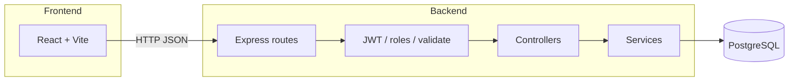

# Географическая викторина

Веб-приложение в формате квиза по географии: пользователь видит вопрос и отмечает точку на карте, после чего получает результат по точности ответа.  
Проект разделен на два приложения:
- `frontend` — клиентская часть (React + Vite)
- `backend` — серверное API (Express + PostgreSQL + Sequelize)

## Основные возможности

Приложение объединяет игровой клиент на карте (Leaflet) и REST API с ролевой моделью (`user` / `admin`). Ниже — возможности по ролям и режимам.

### Игрок (`user`)

| Возможность | Кратко |
|-------------|--------|
| **Регистрация и вход** | Создание учётной записи, выдача JWT, хранение токена на клиенте |
| **Бесконечный режим** | Случайный активный вопрос, ответ кликом по карте, начисление очков (повтор по тому же вопросу в этом режиме не даёт баллов) |
| **Коллекции** | Просмотр наборов вопросов, старт игровой **сессии** с фиксированным порядком (или перемешиванием — по настройке коллекции) |
| **Лидерборды** | Рейтинги для бесконечного режима и для отдельной коллекции |

### Администратор (`admin`)

| Возможность | Кратко |
|-------------|--------|
| **Вопросы** | Просмотр списка и карточки, создание и обновление (валидация на сервере), подсказки по названию |
| **Коллекции** | Просмотр списка и карточки с вопросами, обновление названия/описления/флага порядка и **полного состава** коллекции (связи `question_id` + `position` в теле `PUT`) |

> **Заметка по данным:** для демонстрационного наполнения БД используйте **`npm run seed`** в каталоге `backend` (скрипт `src/seed/runSeeds.js`: синхронизация схемы, вопросы, коллекции, связи коллекция–вопрос). Требуется настроенный `backend/.env` и доступная база PostgreSQL.

## Технологический стек

### Frontend

- React 19
- Vite 8
- React Router
- TanStack React Query
- Axios
- Leaflet + React Leaflet
- Tailwind CSS 4

### Backend

- Node.js (ES Modules)
- Express 5
- PostgreSQL
- Sequelize ORM
- JWT (`jsonwebtoken`)
- Валидация через `zod`
- `bcryptjs` для хеширования паролей

## Архитектура API

Backend следует типичному **слоистому** подходу: маршруты (`routes`) → контроллеры (`controllers`) → сервисы (`services`) → модели Sequelize (`models`).

| Слой | Назначение |
|------|------------|
| **Routes** | Объявление URL и привязка middleware (аутентификация, роли) |
| **Middlewares** | JWT (`authMiddleware`), проверка роли `admin` (`roleMiddleware`), валидация тела/параметров (`validate` + схемы `zod`) |
| **Controllers** | Разбор запроса, вызов сервиса, формирование HTTP-ответа и кодов ошибок |
| **Services** | Бизнес-логика: выбор вопросов, подсчёт расстояния и очков, работа с сессиями коллекций, лидерборды |
| **Models / DB** | PostgreSQL, синхронизация схемы при старте через `sequelize.sync({ alter: true })` |

Клиент ходит в API с префиксом **`/api`** (базовый URL задаётся во `frontend` через `VITE_API_URL`, по умолчанию в коде клиента — `http://localhost:3000/api/`).



## Структура репозитория

Корень проекта — два независимых Node-приложения и папка с документацией.

```
dl2026_spring_fsd2_zhulpa/
├── backend/
│   ├── src/
│   │   ├── config/          # подключение Sequelize / БД
│   │   ├── controllers/     # HTTP-слой
│   │   ├── middlewares/     # JWT, роли, валидация
│   │   ├── models/          # сущности БД и связи
│   │   ├── routes/          # маршруты API (в т.ч. admin/*)
│   │   ├── services/        # бизнес-логика
│   │   ├── seed/            # демо-данные: runSeeds.js и модули сидов
│   │   ├── utils/           # математика очков, JWT, гео и др.
│   │   ├── validations/     # схемы zod
│   │   └── server.js        # точка входа
│   ├── package.json
│   └── .env.example
├── frontend/
│   ├── src/
│   │   ├── api/             # axios-клиент и вызовы API
│   │   ├── components/      # UI и блоки лендинга / игры
│   │   ├── contexts/        # контекст авторизации
│   │   ├── hooks/
│   │   ├── pages/           # экраны (игра, админка, логин)
│   │   ├── styles/
│   │   ├── utils/
│   │   ├── App.jsx
│   │   ├── main.jsx
│   │   └── routes.jsx
│   ├── package.json
│   └── .env.example
├── docs/
└── README.md
```

## Основные сущности БД

Модели определены в `backend/src/models/`. Связи (автор вопроса/коллекции, M:N вопросов и коллекций через промежуточную таблицу и т.д.) задаются в `backend/src/models/index.js`.

| Сущность | Таблица | Назначение |
|----------|---------|------------|
| **User** | `users` | Пользователь: логин, email, хеш пароля, роль (`user` \| `admin`), дата регистрации |
| **Question** | `questions` | Вопрос: текст, опционально описание и картинка, **эталонные координаты**, тип (`point` / `point_with_radius`), радиус в метрах (если нужен), сложность, автор, статус модерации |
| **Collection** | `collections` | Набор вопросов: название, описание, флаг **случайного порядка**, автор |
| **CollectionQuestion** | `collection_questions` | Связь коллекции и вопроса + **позиция** внутри набора (уникальность пары коллекция–вопрос и коллекция–позиция) |
| **GameSession** | `game_sessions` | Сессия прохождения **коллекции**: пользователь, коллекция, порядок id вопросов, текущий индекс, суммарный счёт, статус, время старта/завершения |
| **AnswerAttempt** | `answer_attempts` | Попытка ответа: пользователь, вопрос, режим (`infinite` \| `collection`), опционально `session_id`, координаты клика, расстояние до цели, время ответа, начисленные очки |

**Инварианты по смыслу:** в режиме **infinite** попытки сохраняются в `answer_attempts` с `session_id = null`; в режиме **collection** ответы привязаны к `game_sessions` и ожидаемому вопросу в текущей позиции (см. `GameService.recordCollectionAnswer`).

## Основные API endpoints

Базовый префикс: **`/api`**. В таблицах ниже указаны пути **относительно** `/api`.

### Корень сервера

| Метод | Путь | Доступ | Описание |
|-------|------|--------|----------|
| `GET` | `/` | Публично | Проверка, что сервер поднят (текстовый ответ) |

### Аутентификация (`/auth`)

| Метод | Путь | Доступ | Описание |
|-------|------|--------|----------|
| `POST` | `/auth/registration` | Публично | Регистрация пользователя |
| `POST` | `/auth/login` | Публично | Вход, выдача JWT |

### Проверки (`/health`)

| Метод | Путь | Доступ | Описание |
|-------|------|--------|----------|
| `GET` | `/health/every` | Публично | Базовая проверка |
| `GET` | `/health/authorized` | JWT | Проверка валидного токена |
| `GET` | `/health/admin` | JWT + роль `admin` | Проверка прав администратора |

### Игра (`/game`) — требуется JWT

| Метод | Путь | Описание |
|-------|------|----------|
| `GET` | `/game/infinite/question` | Случайный активный вопрос для бесконечного режима |
| `POST` | `/game/infinite/answer` | Сохранить ответ в бесконечном режиме, получить обратную связь и очки |
| `POST` | `/game/collection/answer` | Сохранить ответ в рамках сессии коллекции |

### Коллекции (`/collections`) — требуется JWT

| Метод | Путь | Описание |
|-------|------|----------|
| `GET` | `/collections/` | Список коллекций |
| `GET` | `/collections/:collectionId/start` | Старт сессии прохождения коллекции |

### Лидерборд (`/leaderboard`) — публично

| Метод | Путь | Описание |
|-------|------|----------|
| `GET` | `/leaderboard/infinite` | Рейтинг бесконечного режима |
| `GET` | `/leaderboard/collection/:collectionId` | Рейтинг по коллекции |

### Админка (`/admin`) — JWT + роль `admin`

**Вопросы** (`/admin/questions`):

| Метод | Путь | Описание |
|-------|------|----------|
| `GET` | `/admin/questions` | Список вопросов |
| `GET` | `/admin/questions/suggest` | Подсказки по названию |
| `GET` | `/admin/questions/:questionId` | Карточка вопроса |
| `POST` | `/admin/questions` | Создать вопрос |
| `PUT` | `/admin/questions/:questionId` | Обновить вопрос |

**Коллекции** (`/admin/collections`):

| Метод | Путь | Описание |
|-------|------|----------|
| `GET` | `/admin/collections` | Список коллекций (админский обзор) |
| `GET` | `/admin/collections/:collectionId` | Детали коллекции |
| `PUT` | `/admin/collections/:collectionId` | Обновить коллекцию (метаданные и при необходимости список вопросов с позициями) |

## Требования

- Node.js 20+ (рекомендуется LTS)
- npm 10+
- PostgreSQL 14+ (или совместимая версия)

## Установка и настройка

### 1) Клонирование и переход в проект

```bash
git clone <URL_РЕПОЗИТОРИЯ>
cd dl2026_spring_fsd2_zhulpa
```

### 2) Установка зависимостей

Установите зависимости отдельно для backend и frontend:

```bash
cd backend
npm install
cd ../frontend
npm install
```

### 3) Настройка переменных окружения

#### Backend

Создайте `backend/.env` на основе `backend/.env.example`:

```env
PORT=3000

DB_HOST=localhost
DB_PORT=5432
DB_USER=postgres
DB_PASSWORD=your_password
DB_NAME=geo_quiz

BCRYPT_ROUNDS=10
SECRET_KEY=your-secret-key
```

#### Frontend

Создайте `frontend/.env` на основе `frontend/.env.example`:

```env
VITE_API_URL=http://localhost:3000/api/
```

### 4) Подготовка базы данных

1. Создайте базу данных в PostgreSQL (например, `geo_quiz`).
2. Убедитесь, что параметры подключения в `backend/.env` корректны.

При старте backend таблицы синхронизируются автоматически через Sequelize (`sequelize.sync({ alter: true })`).

### 5) Демо-данные (опционально)

После настройки `.env` и создания пустой БД можно один раз выполнить сиды — в БД появятся тестовые вопросы, коллекции и связи между ними (идемпотентно, повторный запуск безопасен):

```bash
cd backend
npm run seed
```

Команда также выполняет `sequelize.sync({ alter: true })`, поэтому схема будет приведена в соответствие с моделями даже до первого запуска сервера.

## Запуск в режиме разработки

Запускайте backend и frontend в двух отдельных терминалах.

### Терминал 1 — backend

```bash
cd backend
npm run dev
```

Сервер по умолчанию: `http://localhost:3000`

### Терминал 2 — frontend

```bash
cd frontend
npm run dev
```

Клиент по умолчанию: `http://localhost:5173`

## Сборка и запуск production-версии

### Frontend (сборка статических файлов)

```bash
cd frontend
npm run build
```

Предпросмотр production-сборки:

```bash
npm run preview
```

### Backend (production-режим)

```bash
cd backend
npm start
```

## Полезные команды

### Frontend

- `npm run dev` — локальная разработка
- `npm run build` — сборка
- `npm run preview` — предпросмотр сборки
- `npm run lint` — проверка ESLint

### Backend

- `npm run dev` — запуск с `nodemon`
- `npm start` — обычный запуск Node.js
- `npm run seed` — наполнение БД демо-данными (`src/seed/runSeeds.js`)